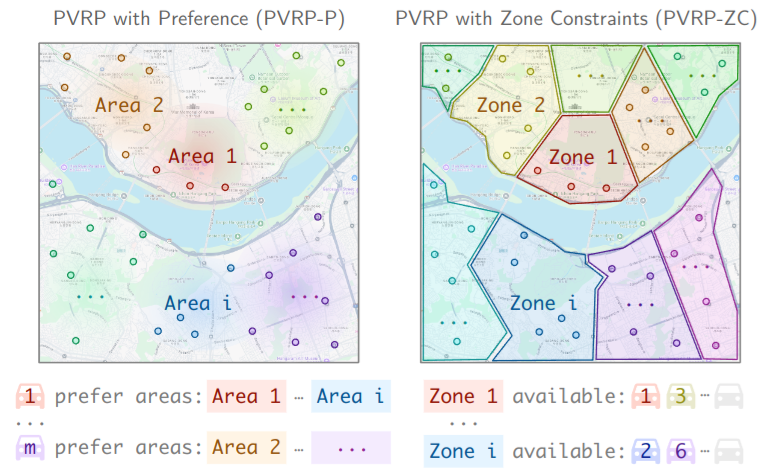
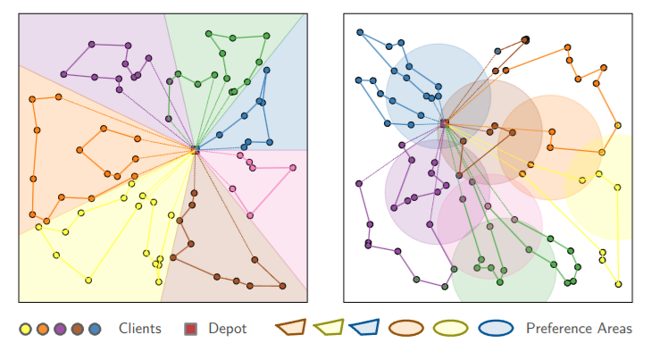

# CAMP
[AAMAS 2025] CAMP: Collaborative Attention Model with Profiles for Vehicle Routing Problems

[](https://arxiv.org/abs/TODO) [](https://join.slack.com/t/rl4co/shared_invite/zt-1ytz2c1v4-0IkQ8NQH4TRXIX8PrRmDhQ)
[](https://opensource.org/licenses/MIT)


> [!IMPORTANT]
> **This repository is under construction.** We are cooking up the codebase and will release it as soon as we get the bandwidth to do so. Stay tuned!


<div align="center">
    
    <i>CAMP Model Overview</i>
</div>

<br>

<p align="center">
    
    
    
</p><p align="center"><i>Left: PVRP (Profiled Vehicle Routing Problem) examples. Right: CAMP solutions respecting preferences and zones. </i></p>


## 🤩 Citation

If you find PARCO valuable for your research or applied projects:
```bibtex
@inproceedings{hua2025camp_vrp,
    author={Chuanbo Hua and Federico Berto and Jiwoo Son and Seunghyun Kang and Changhyun Kwon and Jinkyoo Park},
    title={{CAMP: Collaborative Attention Model with Profiles for Vehicle Routing Problems}},
    booktitle={Proceedings of the 2025 International Conference on Autonomous Agents and Multiagent Systems (AAMAS)},
    year={2025},
    note={\url{https://github.com/ai4co/camp}}
}
```

We will also be happy if you cite the RL4CO framework and PARCO that we built upon:

```bibtex
@article{berto2024parco,
    title={{PARCO: Learning Parallel Autoregressive Policies for Efficient Multi-Agent Combinatorial Optimization}},
    author={Federico Berto and Chuanbo Hua and Laurin Luttmann and Jiwoo Son and Junyoung Park and Kyuree Ahn and Changhyun Kwon and Lin Xie and Jinkyoo Park},
    year={2024},
    journal={arXiv preprint arXiv:2409.03811},
    note={\url{https://github.com/ai4co/parco}}
}

@article{berto2024rl4co,
    title={{RL4CO: an Extensive Reinforcement Learning for Combinatorial Optimization Benchmark}},
    author={Federico Berto and Chuanbo Hua and Junyoung Park and Laurin Luttmann and Yining Ma and Fanchen Bu and Jiarui Wang and Haoran Ye and Minsu Kim and Sanghyeok Choi and Nayeli Gast Zepeda and Andr\'e Hottung and Jianan Zhou and Jieyi Bi and Yu Hu and Fei Liu and Hyeonah Kim and Jiwoo Son and Haeyeon Kim and Davide Angioni and Wouter Kool and Zhiguang Cao and Jie Zhang and Kijung Shin and Cathy Wu and Sungsoo Ahn and Guojie Song and Changhyun Kwon and Lin Xie and Jinkyoo Park},
    year={2024},
    journal={arXiv preprint arXiv:2306.17100},
    note={\url{https://github.com/ai4co/rl4co}}
}
```

