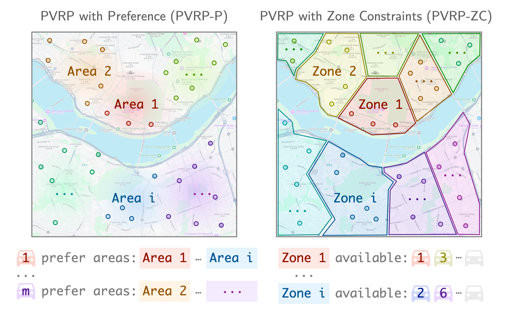
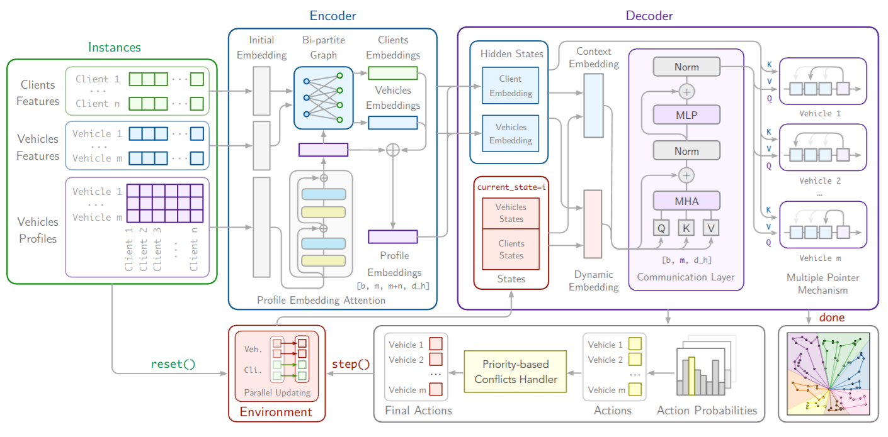
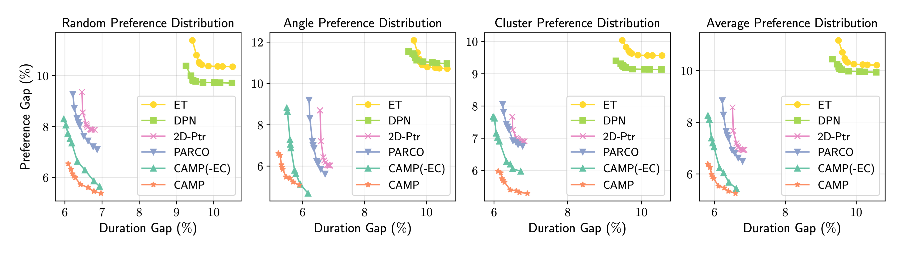
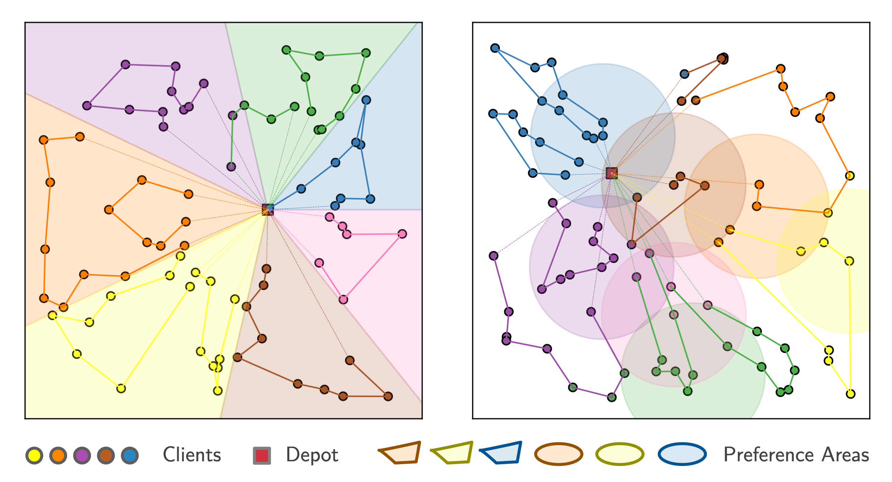

# ⛺️ CAMP: Collaborative Attention Model with Profiles for Vehicle Routing Problems

This is the codebase for the paper *[CAMP: Collaborative Attention Model with Profiles for Vehicle Routing Problems](https://arxiv.org/abs/2501.02977)* published in the proceeding of the *24th International Conference on Autonomous Agents and Multi-Agent Systems* (**AAMAS 2025**).

[](https://arxiv.org/abs/2501.02977) [](https://join.slack.com/t/rl4co/shared_invite/zt-3jsdjs3ec-3KHdV3HwanL884mq_9tyYw)
[](https://opensource.org/licenses/MIT)


> [!IMPORTANT]
> **This repository is under construction.** We are cooking up the codebase and will release it as soon as we get the bandwidth to do so. Stay tuned!

## 💡 Introduction

### *Q. What's the target problem?*

We solve the *Profiled Vehicle Routing Problem* (**PVRP**), which extends the classic *Vehicle Routing Problem* (**VRP**) by incorporating vehicle-specific profiles that define how different vehicles interact with clients. Our implementation focuses on two variants:

**PVRP with Preferences (PVRP-P)**

- Assigns preference scores to vehicle-client pairs;
- Optimizes both route efficiency and preference satisfaction;
- Uses a balancing parameter to weigh between minimizing travel costs and maximizing preferences.

**PVRP with Zone Constraints (PVRP-ZC)**

- Enforces hard constraints on which vehicles can serve specific clients;
- Models restricted zones or access limitations;
- Implemented using preference scores where prohibited combinations are assigned large negative values.

This makes the problem particularly relevant for real-world applications where vehicles have different characteristics or operational constraints. We show the practical examples of PVRPs as following: [Left] PVRP-P has preference zones for each vehicle profile. [Right] PVRP-ZC has zone constraints for certain vehicles.

<div align="center">
    
</div>


### *Q. How do we solve the problem?*

We proposed *Collaborative Attention Model with Profiles* (**CAMP**), which is a multi-agent reinforcement learning model designed specifically for solving PVRPs. Key features:

- **Profile-Aware Encoding**: Uses attention mechanisms to create unique representations for each vehicle-client combination based on their profiles;
- **Multi-Agent Communication**: Enables vehicles to share information and make cooperative decisions;
- **Parallel Decision Making**: Each vehicle independently evaluates and selects its next actions while considering other vehicles' states;
- **Attention-Based Pointer**: Efficiently selects the next client for each vehicle based on their profile-specific embeddings.

The model learns to balance individual vehicle constraints with overall fleet efficiency through reinforcement learning, making it adaptable to different PVRP variants. We show the overall illustration of the CAMP model as following: 

<div align="center">
    
</div>


### *Q. How good it is?*

Here are some performance highlights of CAMP:

- Competitive solution quality compared to traditional algorithms;
- Faster computation time than classical methods;
- Strong performance against other neural network approaches:
    - ET: [Equity-Transformer: Solving NP-Hard Min-Max Routing Problems as Sequential Generation with Equity Context](https://arxiv.org/abs/2306.02689);
    - DPN: [DPN: Decoupling Partition and Navigation for Neural Solvers of Min-max Vehicle Routing Problems](https://arxiv.org/abs/2405.17272);
    - 2D-Ptr: [2D-Ptr: 2D Array Pointer Network for Solving the Heterogeneous Capacitated Vehicle Routing Problem](https://dl.acm.org/doi/10.5555/3635637.3662981);
    - PARCO: [PARCO: Learning Parallel Autoregressive Policies for Efficient Multi-Agent Combinatorial Optimization](https://arxiv.org/abs/2409.03811);
- Suitable for real-time routing applications.

The results demonstrate CAMP's effectiveness as a practical solution for complex vehicle routing problems in production environments. We show the Pareto front of the cost of VRP-P against different preference weight for different preference matrix distribution as following. The left
bottom is better.



Also if you want to see the visualization of CAMP solutions of PVRP-P with angle and cluster preference distribution, here we are. CAMP successfully routes according to the preference distribution.

<div align="center">
    
</div>

## 🚀 Usage

> [!IMPORTANT]
> **This repository is under construction.** We are cooking up the codebase and will release it as soon as we get the bandwidth to do so. Stay tuned!

## 🤗 Acknowledgements

- [https://github.com/ai4co/rl4co](https://github.com/ai4co/rl4co);
- [https://github.com/ai4co/parco](https://github.com/ai4co/parco);
- [https://github.com/kaist-silab/equity-transformer](https://github.com/kaist-silab/equity-transformer).
- [https://github.com/farkguidao/2D-Ptr](https://github.com/farkguidao/2D-Ptr);
- [https://github.com/CIAM-Group/NCO_code](https://github.com/CIAM-Group/NCO_code).

## 🤩 Citation

If you find PARCO valuable for your research or applied projects:
```bibtex
@inproceedings{hua2025camp_vrp,
    author={Chuanbo Hua and Federico Berto and Jiwoo Son and Seunghyun Kang and Changhyun Kwon and Jinkyoo Park},
    title={{CAMP: Collaborative Attention Model with Profiles for Vehicle Routing Problems}},
    booktitle={Proceedings of the 2025 International Conference on Autonomous Agents and Multiagent Systems (AAMAS)},
    year={2025},
    note={\url{https://github.com/ai4co/camp}}
}
```

We will also be happy if you cite the RL4CO framework and PARCO that we built upon:

```bibtex
@article{berto2024parco,
    title={{PARCO: Learning Parallel Autoregressive Policies for Efficient Multi-Agent Combinatorial Optimization}},
    author={Federico Berto and Chuanbo Hua and Laurin Luttmann and Jiwoo Son and Junyoung Park and Kyuree Ahn and Changhyun Kwon and Lin Xie and Jinkyoo Park},
    year={2024},
    journal={arXiv preprint arXiv:2409.03811},
    note={\url{https://github.com/ai4co/parco}}
}

@article{berto2024rl4co,
    title={{RL4CO: an Extensive Reinforcement Learning for Combinatorial Optimization Benchmark}},
    author={Federico Berto and Chuanbo Hua and Junyoung Park and Laurin Luttmann and Yining Ma and Fanchen Bu and Jiarui Wang and Haoran Ye and Minsu Kim and Sanghyeok Choi and Nayeli Gast Zepeda and Andr\'e Hottung and Jianan Zhou and Jieyi Bi and Yu Hu and Fei Liu and Hyeonah Kim and Jiwoo Son and Haeyeon Kim and Davide Angioni and Wouter Kool and Zhiguang Cao and Jie Zhang and Kijung Shin and Cathy Wu and Sungsoo Ahn and Guojie Song and Changhyun Kwon and Lin Xie and Jinkyoo Park},
    year={2024},
    journal={arXiv preprint arXiv:2306.17100},
    note={\url{https://github.com/ai4co/rl4co}}
}
```

